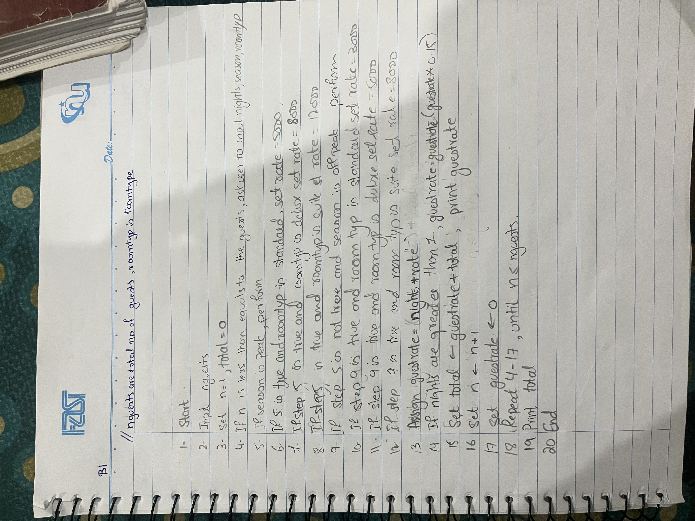
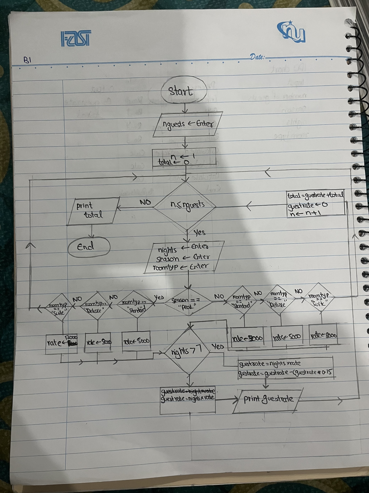

## Name: Rumaisa Fatima          Student ID: 26K-0018         Section: BAI-1A
# PART B QUESTION 1

## IPO
Input: Number of guests, room type, season and nights.
Process: guest rate = nights x rate, discount = guest rate - (guest rate x 0.5), total = guest rate x total
Output: Guest rate, total.

## PAC
Given: Number of guests, room type, season, nights, peak and off season rates, discount and its conditions.
Required: Total revenue and bill of each guest.
Processing: guest rate = nights x rate, discount = guest rate - (guest rate x 0.5), total = guest rate x total

## Output

## Algorithm

## Pseudocode

## Flowchart

## Source Code

