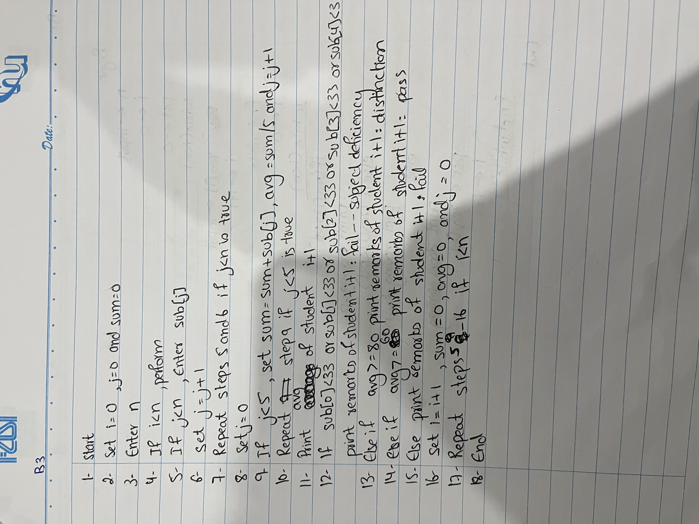
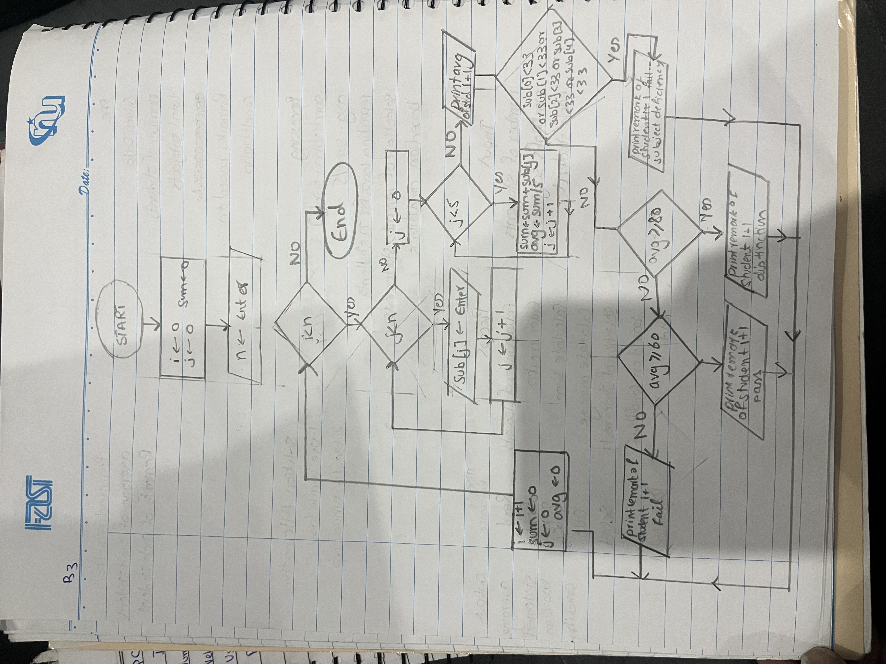

## Name: Rumaisa Fatima          Student ID: 26K-0018         Section: BAI-1A
# PART B QUESTION 3

## IPO
Input: Number of students, marks of 5 subjects of each student.
Process:sum = sum + sub[j], average = sum / 5, selection of statements based on conditions.
Output: Average of each student and remarks based on the condition of each student.

## PAC
Given: Number of students, marks of 5 subjects of each student, remarks based on various conditions.
Required: Average of each student and remarks based on the condition of each student.
Processing: sum = sum + sub[j], average = sum / 5, selection of statements based on conditions.

## Output

## Algorithm

## Pseudocode
[pseudocode pg1](Pseudocode.jpeg)

## Flowchart

## Source Code

