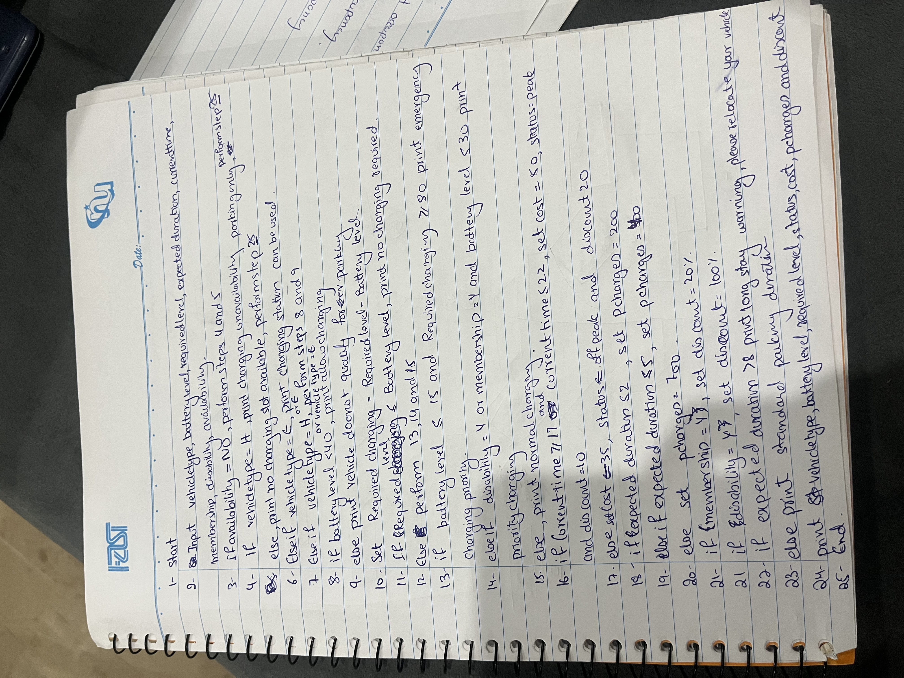

## Name: Rumaisa Fatima          Student ID: 26K-0018         Section: BAI-1A
# PART B QUESTION 6

## IPO
Input: Vehicle type, battery level, required level, expected duration, current time, membership, disability, availability.
Process: Execution of statements based on conditions.
Output: Vehicle type, battery level, required level, status, cost, parking charges and discount.

## PAC
Given: Vehicle type, battery level, required level, expected duration, current time, membership, disability, availability.
Required: Execution of statements based on conditions, vehicle type, battery level, required level, status, cost, parking charges and discount.
Processing: Execution of statements based on conditions.

## Output

## Algorithm

## Pseudocode

## Flowchart

## Source Code

